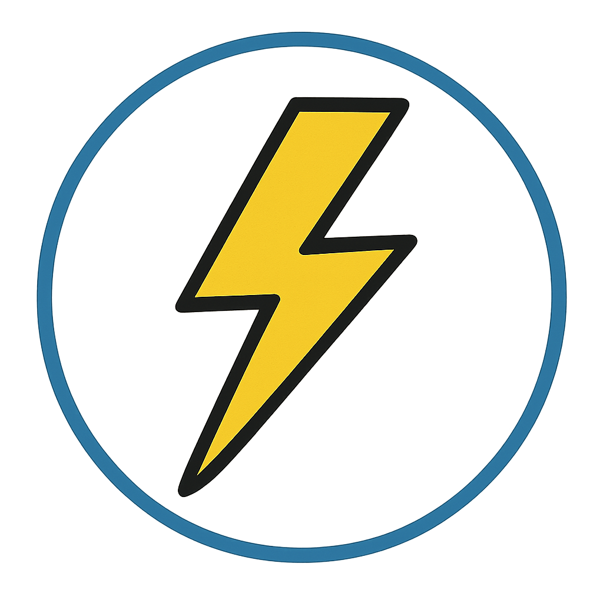

<p align="center">
  
</p>

# Blazed Past Us..

**Silver Surfer asked:**  
_"How fast can a dev blog go?"_

**Gas Git, intrigued, answered:**  
_"I don't know… shall we see?"_

**Silver Surfer looked dubious and curious:**  
_"Very well… let the cosmos bear witness."_

# Notes

- The post file name will be the title.
- There is no need to add the title within the .md file, this will be set by the meta data.
- Post tags are written in every post on the very top as `**tags:** tag1, tag2,...`
- The descriptions of the posts will be a brief showcase of the first paragraph (below the tags).

# Installation

### ⚠️ Package still not available in the npm registry (🧪 under development).

## Install package:

```sh
npm i blazed-past-us
```

## Set up scaffold:

```sh
blazed-past-us
```

## Install dependencies:

```sh
npm i
```

## Run locally:

```
npm run dev
```
